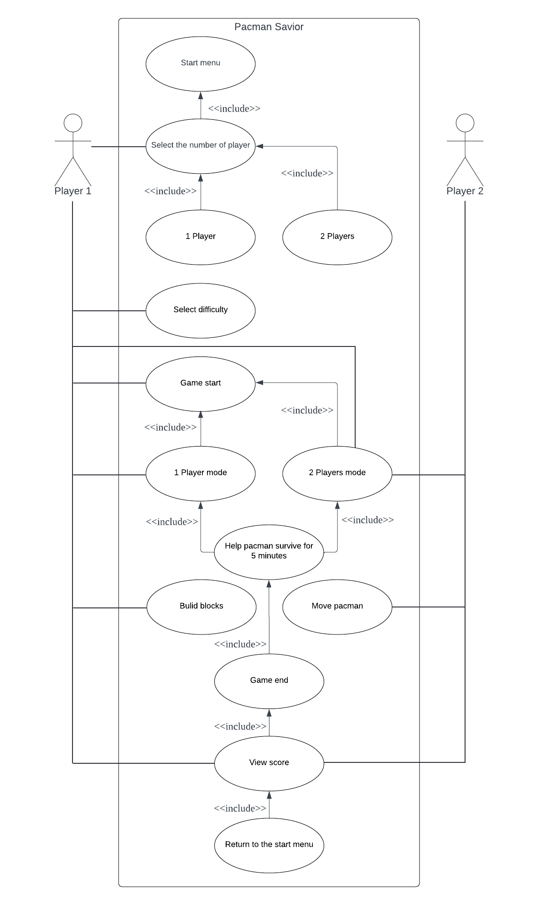
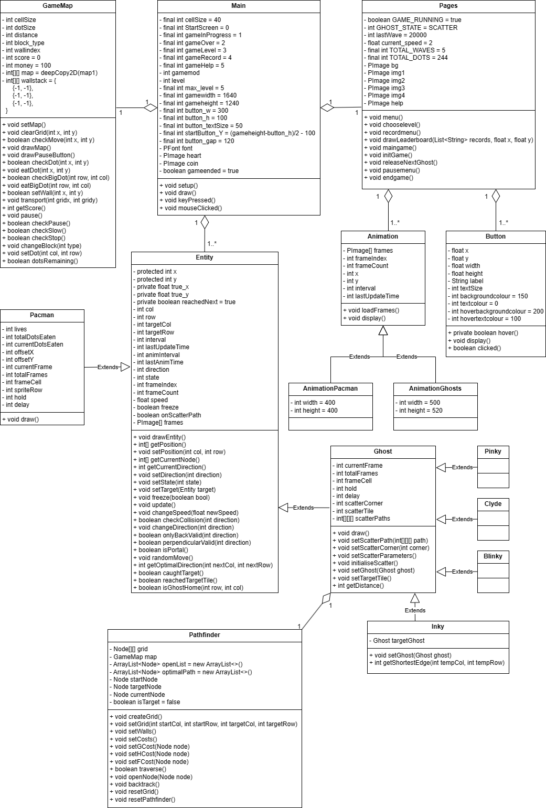

# TEAM 
## 2024-group-4

Kevin Chen   ad23091@bristol.ac.uk   ad23091

Xiaokang Fan dr23824@bristol.ac.uk   SeventyThree73

Tianyi Chen fu23287@bristol.ac.uk    TYChen2000   (GAP)

Nicky Dickson kr23498@bristol.ac.uk   nd1221

# INTRODUCTION

## Game Ideas:

## 1. Vampire Survivors
   
Description: It is an action roguelike game, in this game, players need to survive while encountering an evolving horde of monsters in a select time; eliminating monsters can provide experience for players to level up which will provide several choices for players to choose, like upgrade a old weapon, add a new weapon or add a buff to the player; before the game is started, the player can choose a weapon to start; there will be 3 modes for the player to choose: easy, middle, hard.
   
Challenges: how to create an evolving horde of monsters? how to design different weapons? how to balance the game difficulty and the fun of playing the game?

## 2. Defend Zombies

Description: In Defend Zombies, players take on the role of a gardener using a variety of plants to protect their home from an ever-evolving zombie horde. The game is set during the day in a swimming pool, with waves and types of zombies evolving and increasing over time. Players need to flexibly deploy plants, upgrade strategies, and use special props to defend against zombies. As players progress, they can unlock more plant species and upgrades to face greater challenges.

Challenge: How to design unique zombies? How to design different defense towers? How to balance game difficulty and fun of playing the game?

## 3. Grand Strategy Chess

Description: In "Grand Strategy Chess", players will play the role of generals from different historical periods and command their armies to fight on a map composed of checkerboards. Each checkerboard represents a different terrain, such as plains, mountains, forests, and rivers, and each terrain will have an impact on the outcome of the battle. Players need to use strategic deployment, troop matching and terrain utilization to defeat their opponents and win.

Core gameplay:
Strategic deployment: Before the war, players need to deploy their own troops according to the opponent's arms and the terrain of the map, and reasonably arrange the positions of infantry, cavalry, archers and special units.
Combination of arms: Different arms have their own advantages and disadvantages on different terrains. Players need to choose the most appropriate combination of arms based on the battlefield environment and the opponent's strategy.
Terrain utilization: Use the advantages of the terrain to deploy defense or attack. For example, defending in mountains can greatly reduce the enemy's attack power, and ambush beside a river can limit the enemy's movement.
Tactical change: Players can adjust tactics according to changes in the situation during the battle, such as switching from defense to offense, or using special units to conduct surprise attacks.

Game features:
Rich types of arms and units: Provides a variety of different types of arms and special units, each with its own unique skills and combat style.

Design challenges:
Balance: Ensure that all classes, special units, and terrain effects are balanced in the game, whether in single-player campaigns or multiplayer battles.
Strategic Depth: Designing mechanics and tactical possibilities that are complex enough to satisfy players of all skill levels while keeping the game accessible.
Map and campaign diversity: Create rich and diverse maps and campaign stories to increase the replay value of your game.

## 4. Maze Tank Blitz

Description: In "Maze Tank Blitz", players will drive tanks to fight in a maze full of obstacles and traps. The goal of the game is to use your tank's cannon and special abilities to defeat your enemies while avoiding the maze's traps and enemy attacks. The game offers multiple different maze maps, each with unique designs and challenges. Players can fight alone or with friends in split-screen or online multiplayer modes.

Core gameplay:
Maze exploration: Players need to find the best path in a complex maze to attack enemies while avoiding being discovered and attacked by enemies.
Combat and Strategy: Take advantage of the maze's environment and design to defeat your opponents through strategic deployment and quick reactions.
Upgrades and Customization: After defeating enemies, players can collect resources to upgrade their tanks, including increased firepower, defense, and speed.
Multiplayer mode: supports multiplayer battles and provides an exciting PVP experience.

Game features:
Dynamic Maze System: The layout of the maze is randomly generated each time you play, providing players with an ever-changing challenge and exploration experience.
Diverse equipment: Provides a variety of weapon options, each with its own characteristics and tactical value.
Special abilities and props: Players can find or earn special abilities and props in the maze, such as invisibility cloaks, speed acceleration, and powerful cannonballs, adding more variables to the battle.

challenges:
Balance: Ensure balance between all weapons to make the game both fair and challenging.
Maze generation algorithm: Design an algorithm that can generate fair and interesting maze layouts to provide a diverse gaming experience.

## 5. Pac-Man Savior (selected)
   
Description: The original Pac-Man is a classic arcade game that was created by Namco in 1980. It features a yellow, circular character that moves around a maze, eating dot and avoiding ghosts.

Twist: In our version of Pac-Man, both the character and the ghost will be controled by AI, and the player's task is to build blocks to keep the ghosts away from the character and all the dots that are eaten by the character will become money which can be used to buy more blocks, and there are different kinds of blocks that can be bought which have different abilities like slow or stop the ghost for a while.
   
Challenges: how to design and program different kinds of blocks? how to design the AI for the character and the ghost? how to balance the game difficulty?

# REQUIREMENTS

## Stakeholders

* Developers of the game
* Project manager of the game
* Players of the game
* The markers of the project

## User Storeies

As a developer, I want to make a game that is popular, so that my game could have more exposure to people and I could earn more reputation.

As the project manager, I want to ensure the game developed is meeting all the requirements, so that the project can be developed according to the plan.

As a player, I want to choose different modes of the game so that I can choose the game's difficulty based on my interests.

As a player, I want to know the direction of my character, so that I can know where it will go.

As a player, I want to have cases or tutorial examples telling me some of special designs of the game.

As a marker for this project, I want to see groups create engaging and well made games, with a good twist that is interesting, and a strong process of development that utilises the techniques taught in this module.

## Use-case specifications

| Use-Case Section                        | 2 players vs Computer                                      | 1 player vs Computer                                                                                                     |
|-----------------------------------------|-----------------------------------------------|-----------------------------------------------------------------------------------------------------------------|
| **Description**                         | 1 player play the blocker 1 player play the pacman against 4 ghosts play by the computer     | player play the blocker,one computer play the pacman, against 4 ghosts play by the computer                                             |
| **Basic Flow**                          | Ghosts need to catch the pacman, blocker need to stop that                    | Ghosts need to catch the pacman, blocker need to stop that                                          |
| 1.                                      | Players can choose to be the blocker or the pacman, Players can choose the difficulty, which will change the abilities of the ghost | Players can choose the difficulty, which will change the abilities of the ghost                                          |
| 2.                                      | Blocker LEFT-CLICK and drag the block to place blocks if the money is enough; the other player use WASD to control the pacman's move | Blocker LEFT-CLICK and drag the block to place blocks if the money is enough|
| 3.                                      | Game ends                                  | Game ends                                                                     |
|                                         |                                               |                                                                                                                 |
| **Alternative Flow**                    |                                               |                                                                                                                 |
| A1                                      | 1. Pacman eats a dot, the blocker's money increase by 1                                |                                                                                                                 |
|                                         | 2. Back to Basic Flow 1.                    |                                                                                                                 |
| A2                                      | 1. Pacman eats all the dots                                    |                                                                                                                 |
|                                         | 2. Back to Basic Flow 3.                    |                                                                                                                 |
| A3                                      | 1. Blocker purchases a block and place it                                    |                                                                                                                 |
|                                         | 2. Back to Basic Flow 1.                    |                                                                                                                 |
| A4                                      | 1. Ghost catch the pacman                           |                                                                                                                 |
|                                         | 2. Back to Basic Flow 3.                    |                                                                                                                 |
=======

* Select 1 player or 2 players

* Settings screen
    * Choose the difficulty of the game
    * Show some examples of how to play the game
    * Choose the map of the game

* Game starts

* Player bulids blocks to stop the ghosts from getting pacman and help pacman to eat all the dots

* Final screen: Pacman / Ghosts win

## Use-case diagram

## Reflection

In the early stage design of the game, we learned that:

* User Story:
1. A user story is a non-technical description of how a player interacts with an element in a game. It focuses on the player’s experience, emotions, and the narrative they derive from the interaction.
2. Game designers use user stories to explain why a game needs a specific feature. Instead of using technical jargon, they create relatable scenarios.

* Use Case:
1. Use cases provide an in-depth look at system behavior. They outline all the steps required to achieve a desired goal.
2. Unlike user stories, use cases are more detailed and focus on system requirements. They help developers understand how different components interact.
3. For game development, use cases might describe scenarios like player login, combat mechanics, or inventory management. They guide the implementation process.
4. In summary, use cases offer context, planning structure, and a comprehensive understanding of system behavior.

Both user story and use case play crucial roles in game development, ensuring that games are not only technically sound but also engaging and enjoyable for players.

# DESIGN

## System Architecture

* Start Menu
   * START: start the main game
   * LEVEL: choose the difficulty of the game, 5 levels in total, higher levels means higher difficulty and higher score
   * RANKING; show the 5 top score and their player in the ranking list
   * HELP: show the function of the all the UI in the main game
   * EXIT：exit the game
 
* Main Game

* End Scene
   * YOU WIN: if pacman eat all the dots, you win
   * GAME OVER: if pacman's health is decreased to 0, the game is over

## Class Diagram

# IMPLEMENTATION

## Challenges
1. Pacman and ghosts's movement logic design & implementation.
2. Interaction between blocks and other things.
3. How to balance different difficulties and the prices of the blocks.

# EVALUATION

## Heuristic Evaluation
* Project Title: Pacman Savior

* Suggestions from players:
1. Add more interface/UI for the game to improve the HCI experience.
2. Add more instructions for the game to guide the players.
3. Add more difficulties to the game to add different experience.

# PROCESS

# CONCLUSION

# INDIVIDUAL CONTRIBUTION

| Juean Chen                                | Xiaokang Fan                         | Nicky Dickson                        |
|-------------------------------------------|--------------------------------------|--------------------------------------|
| UI design & implementation                | Game framework construction          |                                      |
| Maps design & implementation              | Game engineering framework design    |                                      |
| Block design & implementation             | Implement most page designs          |                                      |
| Original pacman movement logic design     | Implement the button class to simplify button implementation |              |
| Fix some bugs                             | Implement animation class            |                                      |
| Write report                              | Optimize entity classes, extend movement methods and give physical meaning ||
|                                           | Simplify ghost drawing logic         |                                      |
|                                           | Design game record manager class     |                                      |
|                                           | Fix some bugs                        |                                      |
|                                           | Algorithm optimization               |                                      |
